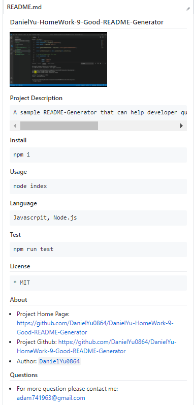

# DanielYu-HomeWork-9-Good-README-Generator




### Project Description
```md
A sample README-Generator that can help developer quickly create a professional README for a new project
```

### Install
```md
npm i
```

### Usage
```md
node index
```

### Language
```md
Javascrpit, Node.js
```

### Test
```md
npm run test
```

## License
```md
* MIT
```

## About
* Project Home Page: https://github.com/DanielYu0864/DanielYu-HomeWork-9-Good-README-Generator
* Project Github:  https://github.com/DanielYu0864/DanielYu-HomeWork-9-Good-README-Generator
* Author: [`DanielYu0864`](https://github.com/DanielYu0864)

## Questions
*  For more question please contact me: adam741963@gmail.com
